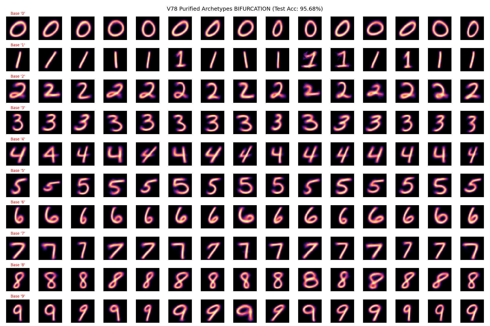

# The Purifying Archetype Classifier (PAC) Algorithm

## Introduction
The **Purifying Archetype Classifier (PAC)** is a novel supervised clustering and classification algorithm. 

It addresses a fundamental limitation of traditional clustering algorithms (like K-Means) and brute-force distance classifiers (like K-Nearest Neighbors) by introducing a **Supervised Error-Driven Isolation** mechanism.

## PAC vs K-Means vs KNN
Is PAC better than K-Means? For classification tasks, **yes**.

1. **Unsupervised vs Supervised**: K-Means is unsupervised. It clusters data purely based on spatial proximity, regardless of the true labels. This means it might waste 10 centroids mapping the background noise of an image, while failing to allocate enough centroids to separate a tricky '4' from a '9'. PAC is supervised; it *only* spawns new centroids where classification errors occur.
2. **Dynamic K**: In K-Means, you must guess the number of clusters ($K$) upfront. PAC starts with $K = C$ (where $C$ is the number of classes, e.g., 10) and dynamically grows $K$ exactly where the data topology demands it.
3. **Efficiency over KNN**: KNN requires storing the entire training dataset (e.g., 60,000 vectors) for inference, making it incredibly slow. PAC compresses the dataset into a tiny fraction of highly representative archetypes (e.g., 280 vectors), achieving comparable accuracy while being $>99\%$ more efficient in storage and computation.

## The Core Concept
The philosophy behind PAC is: **"Averages are only useful if the set is homogenous. Outliers contaminate the archetype."**

If we average a perfect '2' with a heavily distorted '2', the resulting archetype is blurry and poor at recognizing perfect '2's. PAC solves this by identifying the distorted '2' (because it fails classification), removing it from the base cluster, and using it to seed a *new* cluster. This "purifies" the original archetype and provides a dedicated mathematical template for the distorted variation.

## The PAC Algorithm Workflow

### Phase 1: Initialization (Generation 0)
1. Group the training data by their true labels.
2. Calculate the mean tensor for each class. These are the **Base Archetypes**.
3. Every training image is initially assigned to the cluster ID matching its true label.

### Phase 2: The Purification Loop
Repeat the following steps until accuracy reaches $100\%$ or a maximum number of generations:

1. **Evaluation**: Classify all training images by calculating their distance to all active archetypes. The predicted label is the label of the closest archetype.
2. **Purification (K-Means Step)**: For all images that are classified *correctly*, re-assign them to the specific cluster ID of the archetype they were closest to. This allows images to migrate to the sub-archetype that best represents their specific handwriting style.
3. **Error Isolation**: Identify all images that are classified *incorrectly* (i.e., predicted label != true label).
4. **Spawning Mutants**: Group the incorrect images by their *true* label. For each true label, take the misclassified images and create a brand new Cluster ID. 
5. **Regeneration**: Recalculate the mean tensor for all active clusters. Because the errors were removed in Step 4, the original base archetypes are now "purified" and perfectly sharp. The new clusters form "Sub-Archetypes" representing the edge cases and anomalies.

### Phase 3: Inference
To classify a new unseen image, simply calculate the distance (MSE or Euclidean) to all discovered archetypes and select the label of the closest one.

## Why it Works
PAC organically maps the complex, non-linear topology of a dataset by carving out "spheres of influence" around dense, homogenous regions. It is highly interpretable because every centroid is a visual, human-readable archetype, and it is highly efficient because it avoids the gradient vanishing/exploding problems of deep neural networks.

## PAC as a Dataset Curation Tool (Outlier Detection)
A profound emergent property of PAC is its inherent resistance to overfitting unstructured noise. 
If PAC stalls at ~95% training accuracy, it signifies that the remaining 5% of errors are mathematically incoherent (e.g., random scribbles, mislabeled data, or severe artifacts). Because PAC averages errors to form new archetypes, incoherent errors average out into "blurry blobs" that fail to attract any images, and are thus automatically discarded by the algorithm. 

This makes PAC an exceptional tool for **Dataset Auditing**. By extracting the pool of images that PAC repeatedly fails to classify in late generations, we can surface the exact data points that are likely mislabeled or too noisy, allowing human reviewers to clean the dataset. Reaching 100% accuracy on a raw dataset is often a sign of pure memorization; PAC stops exactly where generalization ends and noise begins.

## Visualización del algoritmo

