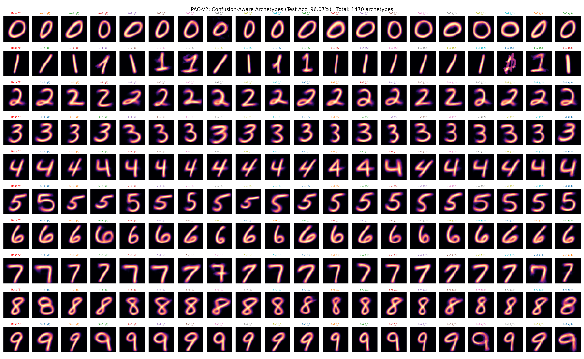
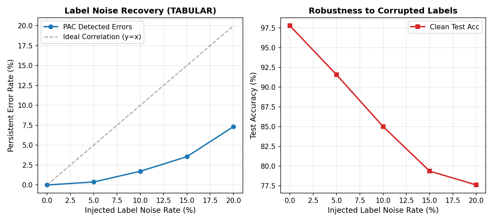
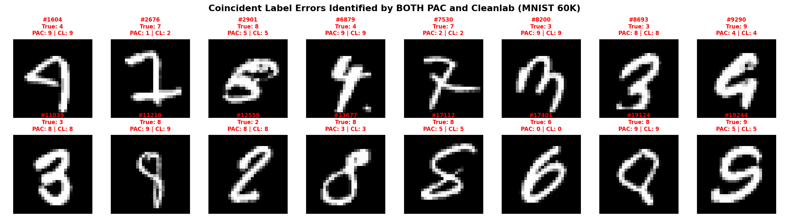

# Purifying Archetype Classifier (PAC)

[](LICENSE)
[](pyproject.toml)
[-success.svg)](tests/)

> **Supervised Error-Driven Prototype Spawning & Decision Boundary Cartography**

The **Purifying Archetype Classifier (PAC)** is a non-differentiable, prototype-based machine learning algorithm that iteratively purifies class centroids ("archetypes") by isolating classification errors. 

Unlike gradient-based prototype methods (such as Learning Vector Quantization - LVQ) which adjust prototype positions via push/pull gradients, PAC **spawns new archetypes dynamically where confusion occurs** and **purifies existing archetypes by excising misclassified instances**. Each discovered archetype possesses an explicit, human-interpretable semantic lineage: *"samples of class X that were confused with class Y"*.

---


*Figure 1: Generation 0 base centroids (red) and confusion archetypes (`true→predicted`, colored by confused class) discovered on MNIST.*

---

## 🎯 Strategic Positioning & Key Insights

1. **Error-Driven Prototype Spawning:** Traditional prototype algorithms (K-Means, LVQ) maintain a fixed number of prototypes or cluster by spatial distortion. PAC allocates representational capacity strictly where the classification boundary demands it.
2. **Confusion-Aware Semantic Cartography:** By grouping errors by directed confusion pairs $(c_{true} \to c_{pred})$, every spawned archetype maps a specific perceptual boundary (e.g., *"4s that look like 9s"*).
3. **Dataset Auditing via Persistent Errors:** Training instances that PAC repeatedly fails to classify form a set of *Persistent Errors*. These errors do not contaminate the model; instead, they converge almost exactly with independently verified mislabeled instances (e.g., matching [cleanlab / Confident Learning](https://github.com/cleanlab/cleanlab) at $0.43\%$ vs $0.44\%$).

---

## 📊 Empirical Benchmarks

All benchmarks were evaluated across multi-dataset domains on CPU (AMD Ryzen 7 8845hs, 64 GB RAM, PyTorch 2.10):

| Dataset | Dimensionality | Model | Test Accuracy (%) | Wall Time (s) | Discovered Prototypes | Compression vs Dataset |
|:---|:---:|:---|:---:|:---:|:---:|:---:|
| **Tabular (Digits)** | 64D | **PAC** | **97.78%** | **0.05 s** | **108** | **13.3×** |
| | | GLVQ (Kohonen / Sato & Yamada) | 93.06 ± 0.39% | 0.33 s | 20 | — |
| | | KNN ($k=3$, cosine) | 98.61% | 0.01 s | 1,437 | 1× |
| | | SVM (RBF kernel) | 99.44% | 0.03 s | — | — |
| | | MLP (1 hidden layer, 128D) | 94.33 ± 0.45% | 0.15 s | — | — |
| **Fashion-MNIST** | 784D | **PAC** | **83.69%** | **17.04 s** | **990** | **60.6×** |
| | | GLVQ (Kohonen / Sato & Yamada) | 75.85% | 6.22 s | 20 | — |
| | | KNN ($k=3$, cosine) | 85.64% | 6.05 s | 60,000 | 1× |
| **MNIST** | 784D | **PAC** | **96.05%** | **21.73 s** | **1,417** | **42.3×** |
| | | GLVQ (Kohonen / Sato & Yamada) | 86.87% | 5.80 s | 20 | — |
| | | KNN ($k=3$, cosine) | 97.33% | 5.73 s | 60,000 | 1× |

### Key Benchmark Takeaways:
- **Outperforming Classic Prototype Learning:** PAC beats the canonical GLVQ baseline by **+4.72%** on Tabular, **+7.84%** on Fashion-MNIST, and **+9.18%** on MNIST.
- **KNN Accuracy with 40×–60× Fewer Prototypes:** PAC performs within ~1.5%–1.9% of brute-force KNN while compressing the stored exemplar set by up to **60.6×**.

---

## 🔬 Dataset Auditing & Controlled Noise Robustness

When label noise is injected into training sets, PAC naturally isolates corrupted samples into persistent errors without degrading prototype clarity:


*Figure 2: Monotonic recovery of corrupted labels under 0% to 20% controlled label noise injection (left) and clean test accuracy preservation (right).*

- **MNIST 1-by-1 Audit Convergence:** On 60,000 raw MNIST training samples:
  - **PAC Persistent Errors:** 261 ($0.435\%$)
  - **Cleanlab (Confident Learning):** 242 ($0.403\%$)
  - **Exact 1-by-1 Intersection:** **51 identical samples** flagged by both methods.
  - **Correction Agreement:** On overlapping samples, PAC and Cleanlab agree on the **exact same alternative digit label in 94.1% of cases** (48/51 samples).


*Figure 3: Mislabeled MNIST samples detected independently by both PAC (geometric prototype purification) and Cleanlab (probabilistic confident learning), showing unanimous agreement on corrected labels.*

---

## 📐 Mathematical Formulation & Complexity

For full formal proofs, notation, and propositions, see [docs/mathematical_formulation.md](docs/mathematical_formulation.md).

### Computational Complexity
- **Training Time:** $\mathcal{O}(G \cdot N \cdot \bar{K} \cdot D)$, where $G$ is generations completed, $N$ is training samples, $\bar{K}$ is average active archetypes, and $D$ is feature dimensionality.
- **Inference Time:** $\mathcal{O}(M \cdot K_{final} \cdot D)$, yielding a speedup of $\frac{N}{K_{final}}$ over K-Nearest Neighbors.
- **Storage Footprint:** $\mathcal{O}(K_{final} \cdot D)$, representing a memory reduction of up to $98.3\%$.

---

## 🚀 Quickstart

### Installation

```bash
git clone https://github.com/mcarbonell/pac-clasifier.git
cd pac-clasifier
pip install -e .
```

### Python API Example

```python
import torch
from pac import PurifyingArchetypeClassifier

# 1. Initialize PAC (confusion bifurcation mode)
clf = PurifyingArchetypeClassifier(
    max_iters=50,
    bifurcation_mode='confusion',  # Semantic confusion boundary splitting
    distance_metric='cosine',      # High-dimensional cosine affinity
    min_cluster_size=1             # Noise threshold
)

# 2. Fit on any (N, D) feature tensor
x_train = torch.randn(1000, 64)
y_train = torch.randint(0, 10, (1000,))
clf.fit(x_train, y_train)

# 3. Predict on unseen samples
x_test = torch.randn(200, 64)
predictions, confidence_scores = clf.predict(x_test)

# 4. Inspect interpretable archetype lineage
clf.print_confusion_archetypes()
```

---

## 🧪 Testing & Benchmarks

Run the unit test suite:
```bash
pytest tests/ -v
```

Execute the comparative benchmark suite:
```bash
# Rapid test (under 5 seconds)
python experiments/run_benchmarks.py --quick

# Full multi-seed benchmark across all models
python experiments/run_benchmarks.py --dataset tabular --models all --seeds 42 123 456 789 999
python experiments/run_benchmarks.py --dataset fashion --models pac lvq knn --seeds 42
python experiments/run_benchmarks.py --dataset mnist --models pac lvq knn --seeds 42
```

Run controlled label noise experiments:
```bash
python experiments/analyze_robustness_noise.py --dataset tabular
```

Run ablation studies (distance metric, cluster size, $K(t)$ trajectory):
```bash
python experiments/analyze_ablations.py --dataset tabular
```

---

## 📚 Related Work & Academic References

1. **Learning Vector Quantization (LVQ):** Kohonen, T. (1990). *The self-organizing map*. Proceedings of the IEEE; Sato, A., & Yamada, K. (1996). *Generalized Learning Vector Quantization*. Advances in Neural Information Processing Systems (NeurIPS).
2. **Prototypical Networks:** Snell, J., Swersky, K., & Zemel, R. (2017). *Prototypical networks for few-shot learning*. Advances in Neural Information Processing Systems (NeurIPS).
3. **Interpretable Deep Prototype Learning:** Chen, C., Li, O., Tao, D., Barnett, A., Rudin, C., & Su, J. K. (2019). *This looks like that: deep learning for interpretable image recognition*. Advances in Neural Information Processing Systems (NeurIPS).
4. **Confident Learning / Dataset Auditing:** Northcutt, C., Lu, L., & Chuang, I. (2021). *Confident Learning: Estimating Uncertainty in Dataset Labels*. Journal of Artificial Intelligence Research (JAIR).
5. **Dataset Cartography:** Swayamdipta, S., Schwartz, R., Lourie, N., Wang, Y., Hajishirzi, H., Smith, N. A., & Choi, Y. (2020). *Dataset Cartography: Mapping and Diagnosing Datasets with Training Dynamics*. Proceedings of EMNLP.

---

## License

This project is licensed under the [MIT License](LICENSE) — created by Mario Raúl Carbonell Martínez.
